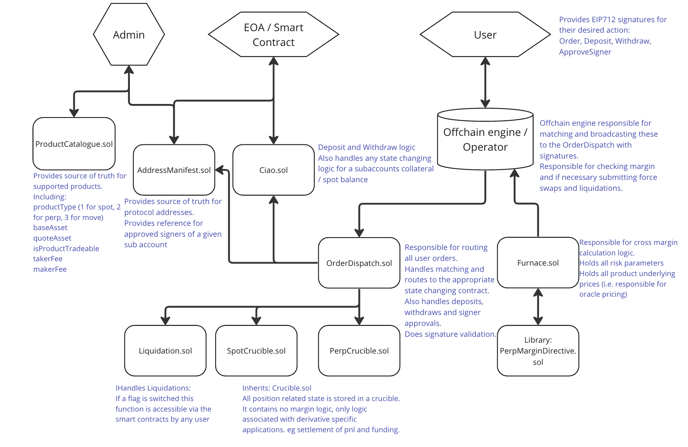

# Rysk Ciao Protocol

Core smart contracts of Rysk Ciao.



## Contracts

Rysk Ciao is a decentralized protocol for a multi-derivative orderbook. For speed reasons, the orderbook and matching algorithm are performed in an off-chain server. This repo contains contracts for settlement, margining, and liquidation.

```
contracts
├── crucible
│   ├── Crucible.sol
│   ├── SpotCrucible.sol
│   └── PerpCrucible.sol
├── interfaces
│   ├── Errors.sol
│   ├── Events.sol
│   ├── IAddressManifest.sol
│   ├── ICiao.sol
│   ├── ICrucible.sol
│   ├── IFurnace.sol
│   ├── ILiquidation.sol
│   ├── IOrderDispatch.sol
│   ├── IPerpCrucible.sol
│   └── IProductCatalogue.sol
├── libraries
│   ├── AccessControl.sol
│   ├── BasicMath.sol
│   ├── Commons.sol
│   ├── EnumerableSet.sol
│   ├── MarginDirective.sol
│   └── Parser.sol
├── AddressManifest.sol
├── Ciao.sol
├── Furnace.sol
├── Liquidation.sol
├── OrderDispatch.sol
└── ProductCatalogue.sol
```
oracle provider is stork: https://docs.stork.network/available-stork-feeds

## Instructions

For those intrerested in local development in foundry.

### Installation

1. Install foundry following the instructions here: https://book.getfoundry.sh/getting-started/installation
2. Install solmate dependencies `forge install transmissions11/solmate`
3. Install openzeppelin contract dependencies `forge install OpenZeppelin/openzeppelin-contracts`
4. Install openzeppelin contract upgradeable dependencies `forge install OpenZeppelin/openzeppelin-contracts-upgradeable`
5. Add envs according to env.example

### Run Tests

`forge test`

